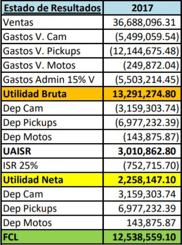

```{r setup, include=FALSE}
knitr::opts_chunk$set(echo = TRUE, fig.align = "center")
```

```{r cache = TRUE, echo=FALSE, message=FALSE, warning=FALSE}
library(dplyr)
library(readr)
library(lubridate)
library(tidyverse)
library(writexl)
library(scales)
```

```{r cache=TRUE, echo=FALSE, message=FALSE, warning=FALSE}
df <- read_csv("c1.csv")
df2 <- df[,(23:28)]
df2 <- df2 %>%
  mutate_all(funs(ifelse(is.na(.), 0, .)))
z <- colSums(df2)
df <- df[,-c(23:28)]
df$Fecha <- as.Date(df$Fecha, '%d-%m-%y')
df <- df %>%
  mutate_all(~str_replace(., "^Q-", "0"))
df <- df %>%
  mutate_all(~str_replace(., "^Q","0"))
```


```{r cache=TRUE, echo=FALSE, message=FALSE, warning=FALSE}
df[,c(3:5, 8:17)] <- sapply(df[,c(3:5, 8:17)], as.numeric)
df_clean <- df
df_clean[is.na(df_clean)] <- "0"
df_clean <- df_clean %>%
  mutate_all(~str_replace(., "^x$","1"))
df_clean[,c(18:22)] <- sapply(df_clean[,c(18:22)], as.numeric)
df_clean[,c(3:5, 8:17)] <- sapply(df_clean[,c(3:5, 8:17)], as.numeric)
```

```{r cache=TRUE, echo=FALSE}
er <- df_clean
ventas_total <- sum(er$factura)
gastos_dep_camiones <- sum(er$fijoCamion_5)
gastos_var_camiones <- sum(er$directoCamion_5)
gastos_dep_pickups <- sum(er$fijoPickup)
gastos_var_pickups <- sum(er$directoPickup)
gastos_dep_motos <- sum(er$fijoMoto)
gastos_var_motos <- sum(er$directoMoto)
datos <- c(ventas_total, gastos_dep_camiones,gastos_var_camiones,gastos_dep_pickups,gastos_var_pickups,gastos_dep_motos,gastos_var_motos)
nombres <- c("ventas_total", "gastos_dep_camiones","gastos_var_camiones","gastos_dep_pickups","gastos_var_pickups","gastos_dep_motos","gastos_var_motos")
datos <- as.data.frame(datos, row.names = nombres)
writexl::write_xlsx(datos, "ER_2017.xlsx")
er$gastos_totales <- df_clean$Camion_5+df_clean$Pickup+df_clean$Moto
```
# Estado de Resultados
### Notas
Asumimos que los gastos de administración representan un 15% del total de ventas, ya que hay que tomar en cuenta pago de sueldos desde los responsables de hacer los cambios/mantenimiento/instalación de postes, seguridad, personal de administración, etc. También establecimos un ISR de 25% que es un monto promedio entre empresas. Analizando el área de postes, se puede observar que la empresa está generando utilidades y tiene un flujo de caja positivo. Es importante tener un flujo de caja positivo ya que la mayoría de empresas quiebran al tener flujos de caja negativos, lo cual significa que no tienen efectivo disponible.

 

\newpage
# Tarifario
El tarifario se encuentra aceptable con los datos que nos proporcionaron, de manera que las ventas por cada tipo de poste se mantienen dentro un rango similar. El margen de ganancia por cada tipo de poste es aproximadamente igual, lo cual es un buen indicador y muestra que la empresa es efectiva manejando costos. Dado a la situación actual del COVID-19, no recomendamos el aumento del tarifario actual. De hacer este cambio, podría resultar en la pérdida de clientes, ya que existen otras empresas de alumbrado compitiendo con ustedes. Para poder hacer un análisis más profundo, sería importante poder proporcionar datos de años anteriores para analizar tendencias de ventas y poder concluir si realmente las tarifas son aceptables por los clientes.
```{r cache=TRUE, echo=FALSE, message=FALSE, warning=FALSE}
tarifario <- er %>% group_by(height) %>%
  summarise(Cantidad = n(), Total_Factura = sum(factura), Total_Gastos = sum(gastos_totales), Tarifario_por_unidad = (Total_Factura/Cantidad), Gastos_por_Unidad = (Total_Gastos/Cantidad), Margen_por_Unidad = (Tarifario_por_unidad-Gastos_por_Unidad), Margen_Porcentual = (Margen_por_Unidad/Tarifario_por_unidad))
names(tarifario)[1] <- "Poste_ID_altura"
```

# Pérdidas en Mantenimiento/Reparación
Si tienen preocupación en cuánto pueden perder en mantenimiento y reparación, habría que enfocarnos en los camiones. Los camiones resultarían la unidad más cara si hablaramos de costos de reparación o mantenimiento. Con la información que nos proporcionaron, vemos que los gastos de depreciación son mayores en los pickups que en los camiones y se puede deber a dos factores. El primero, existe la posiblidad que tengan más unidades de pickups que de camiones y motos. El segundo factor, se debe al número de viajes, que para los pickups fueron un total de 195,733 (camiones 62,267, motos 5,725). Esto resulta directamente en un mayor gasto de depreciación y mantenimiento para los pickups. Por la naturaleza de la industria que se encuentran, no recomendamos ni la compra de unidades nuevas ni la venta de las actuales. Tienen un volumen de ventas constante Simplemente recomendamos que las unidades de transporte actuales sean de marcas asiáticas, ya que los respuestos y mantenimiento de las mismas resultan más económicos que de marcas europeas o de Estados Unidos. 

```{r cache=TRUE, echo=FALSE, message=FALSE, warning=FALSE, echo=FALSE}
pareto <- tarifario %>%
        mutate(
                cumsum = cumsum(Total_Factura),
                freq = round(Total_Factura / sum(Total_Factura), 3),
                cum_freq = cumsum(freq)
               )
```

# Centro de Distribución Nuevo
Los gastos se ven directamente reflejados por los gastos variables(gasolina, llantas, etc) y los gastos fijos (depreciación) de cada unidad de transporte. La empresa actualmente tiene cuatro sucursales, de la cual en solo 2 representan el 80% de los gastos totales. Sería prudente poder abrir una sucursal más, va a requerir capital para construir el espacio o comprarlo. Al tener una sucursal en un punto más cerca de los postes o clientes, reducirá significativamente los gastos variables de cada unidad de transporte.
```{r cache=TRUE, echo=FALSE, message=FALSE, warning=FALSE}
cd <- er %>% group_by(origen) %>%
  summarise(Total_Gasto = sum(gastos_totales))
tg <- sum(cd$Total_Gasto)
cd <- cd %>% mutate(Porcentaje = Total_Gasto/tg)
cd$Porcentaje <- label_percent()(cd$Porcentaje)
```
\newpage

# Top Postes
Podemos ver que las ventas por cada tipo de poste se mantienen un nivel similar.
```{r cache=TRUE, message=FALSE, warning=FALSE ,echo=FALSE}
pareto$cumsum <- 100 * pareto$cumsum/tail(pareto$cumsum, n=1)

scaleright <- tail(pareto$cumsum, n = 1)/ head(pareto$Total_Factura, n=1)

pareto$Poste_ID_altura <- as.factor(pareto$Poste_ID_altura)

limites <- c(0,1,2,3,4,5,6,7,8)

grafica <- ggplot(pareto, aes(x = reorder(Poste_ID_altura, -Total_Factura), fill = Poste_ID_altura)) +
  geom_bar(stat = "identity", aes(y = Total_Factura)) + ylab("Ventas Totales 2017 en Q") + xlab("Poste Altura") + 
  scale_y_continuous(labels = paste0(limites, "M"),
                     breaks = 10^6 * limites)

grafica
```
\newpage
# Top Clientes
A continuación pueden visualizar sus top 15 clientes con sus ventas respectivas del año 2017.
```{r cache=TRUE, echo=FALSE, message=FALSE, warning=FALSE}
library(RColorBrewer)
library(scales)

cliente <- df_clean %>% group_by(ID) %>%
  summarise(Ventas_Total_Poste = sum(factura)) %>%
  arrange(., -Ventas_Total_Poste)
cliente <- head(cliente, 15)

pareto <- cliente %>%
        mutate(
                cumsum = cumsum(Ventas_Total_Poste),
                freq = round(Ventas_Total_Poste / sum(Ventas_Total_Poste), 3),
                cum_freq = cumsum(freq)
               )

pareto$cumsum <- 100 * pareto$cumsum/tail(pareto$cumsum, n=1)

scaleright <- tail(pareto$cumsum, n = 1)/ head(pareto$Ventas_Total_Poste, n=1)

pareto$ID <- as.factor(pareto$ID)

legend_order <- levels(with(pareto, reorder(ID, -Ventas_Total_Poste)))

intervalos <- c(0,5,10,15,20,25,30,35,40,45,50,55)

grafica_clientes <- ggplot(pareto, aes(x = reorder(ID, -Ventas_Total_Poste), fill = ID)) +
  geom_bar(stat = "identity", aes(y = Ventas_Total_Poste)) + 
  geom_path(aes(y=pareto$cumsum/scaleright, group=1),colour="black", size=0.9) +
  geom_point(aes(y=pareto$cumsum/scaleright, group=1),colour="black") +
  scale_y_continuous(sec.axis = sec_axis(~.*scaleright, name = "Acumulativo (%)")) + 
  theme(axis.text.x=element_blank()) + ylab("Ventas Totales 2017 en Miles de Q") +
  scale_fill_discrete(breaks = legend_order) + xlab("Clientes") + ggtitle("Clientes 80/20") + 
  theme(plot.title = element_text(hjust = 0.5)) + scale_y_continuous(labels = intervalos,
                     breaks = 10^3 * intervalos)

grafica_clientes
```
\newpage

# Mantenimiento Postes
A continuación se encuentran los postes que requieren de más mantenimiento anualmente.
```{r cache=TRUE, echo=FALSE, message=FALSE, warning=FALSE}
postes <- df_clean %>% group_by(ID) %>%
  summarise(Numero_de_Servicios = n()) %>%
  arrange(., -Numero_de_Servicios)
postes <- head(postes, 10)
postes
```

```{r cache=TRUE, echo=FALSE, message=FALSE, warning=FALSE}
camiones <- df_clean %>% .[.$Camion_5>0,] %>% subset(., select = -c(4,5,12,13,15,16))
camiones <- camiones %>% pivot_longer(cols = c(12:16), names_to = "Tiempo", values_to = "Count")
camiones <- camiones[camiones$Count>0,]
viajes_camiones <- as.numeric(nrow(camiones))
camiones$Camion_5 <- as.numeric(camiones$Camion_5)
camiones$factura <- as.numeric(camiones$factura)
cam <- subset(camiones, select = c(Camion_5,factura,Tiempo))
names(cam) <- c("Gasto","Venta","Tiempo")
cam$ganancia <- cam$Venta - cam$Gasto
camiones_origen <- camiones %>% group_by(origen) %>%
  summarise(Total_Gasto = sum(Camion_5)) 
```

```{r cache=TRUE, echo=FALSE, message=FALSE, warning=FALSE}
pickups <- df_clean %>% .[.$Pickup>0,] %>% subset(., select = -c(3,5,11,13,14,16))
pickups <- pickups %>% pivot_longer(cols = c(12:16), names_to = "Tiempo", values_to = "Count")
pickups <- pickups[pickups$Count>0,]
viajes_pickups <- as.numeric(nrow(pickups))
pickups$Pickup <- as.numeric(pickups$Pickup)
pickups$factura <- as.numeric(pickups$factura)
pick <- subset(pickups, select=c(Pickup,factura, Tiempo))
names(pick) <- c("Gasto","Venta","Tiempo")
pick$ganancia <- pick$Venta - pick$Gasto
pickups_origen <- pickups %>% group_by(origen) %>%
  summarise(Total_Gasto = sum(Pickup)) 
```

```{r cache=TRUE, echo=FALSE, message=FALSE, warning=FALSE}
motos <- df_clean %>% .[.$Moto>0,] %>% subset(., select = -c(3,4,11,12,14,15))
motos <- motos %>% pivot_longer(cols = c(12:16), names_to = "Tiempo", values_to = "Count")
motos <- motos[motos$Count>0,]
motos$Moto <- as.numeric(motos$Moto)
motos$factura <- as.numeric(motos$factura)
motos_n <- subset(motos, select=c(Moto,factura, Tiempo))
names(motos_n) <- c("Gasto","Venta","Tiempo")
motos_n$ganancia <- motos_n$Venta - motos_n$Gasto
viajes_motos <- as.numeric(nrow(motos))
```

# Recorridos más Efectivos
Los recorridos que toman entre 75-120 minutos son los más efectivos. El criterio es en base a las ganancias en total que generan cada grupo de recorridos. En el caso de que un recorrido se tarde más de 120 minutos, sugerimos poder incrementar lo cobrado en la factura ya que debería por lo menos mostrar un ingreso extra el tiempo invertido adicional.
```{r cache=TRUE, echo=FALSE, message=FALSE, warning=FALSE}
viajes <- rbind(cam,pick,motos_n)
viajes <- viajes %>% group_by(Tiempo) %>%
  summarise(Ganancia_en_Q = sum(ganancia)) %>%
  arrange(., -Ganancia_en_Q)
viajes$Ganancia_en_Q <- format(viajes$Ganancia_en_Q, big.mark = ",")
viajes
```

# Estrategias Sugeridas
## 1. Mantener las tarifas actuales
## 2. Considerar la apertura de un nuevo centro de distribución para disminuir gastos variables.
## 3. Evitar que los recorridos duren más de 120 minutos / cobrar más en estos recorridos.